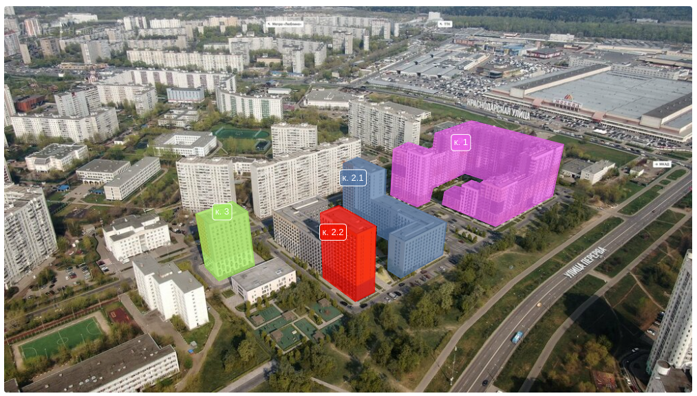

# Библиотека для разметки картинки полигонами
npm: [polygon-paper](https://www.npmjs.com/package/polygon-paper)

Сделано с помощью [paper.js](https://github.com/paperjs/paper.js)

## Что делает: 
Даёт возможность нарисовать один или несколько полигонов на изображении и получить координаты их вершин и центра в виде JS-объектов.
Центр можно двигать отдельно.

## Для чего:
Например, для внутренней разметки изображений. Чтобы красиво подсветить какие-то участки изображения и показать около них подсказку,
сначала нужно знать, что именно нужно подсвечивать.

## Как это выглядит


_Цвета выбираются псевдослучайно, см. [src/utils/polygonColorGenerator.ts](./src/utils/polygonColorGenerator.ts)_

## Установка и подключение
1. Установить библиотеку: `npm install polygon-paper`
2. Создать `canvas`-элемент на странице с заданными высотой и шириной: `<canvas width="1000" height="1000" id="mycanvas" />`
Canvas-элемент будет сжиматься по одной из сторон в зависимости от пропорций картинки. Например, если картинка имеет разрешение 500x200 (ширина x высота), canvas из примера выше уменьшится до 1000x400 - сохраняя оригинальную максимальную ширину, но уменьшая высоту, чтобы итоговый canvas был пропорционален картинке.
3. Импортировать библиотеку: `import { Draw } from 'polygon-paper'`
4. Создать экземпляр класса `Draw` и инициализировать его, передав в него ссылку на ранее созданный canvas и url картинки для разметки:
```js
const draw = new Draw();
const canvasElement = document.getElementById("mycanvas");
const imageUrl = "https://resource.com/image-to-draw-on.png";

draw.init(canvasElement, imageUrl);
```
Опционально, в конструктор `new Draw()` можно передать объект с настройками, о нём в разделе *API*.

Опционально, в `draw.init(canvasElement, imageUrl, initialPolygons)` можно передать массив с полигонами (initialPolygons), которые надо отрисовать изначально (например, сохранённые ранее и загруженные в текущей сессии). О структуре полигонов, которые нужно передать, смотрите в разделе *API*.

5. Для получения информации об изменении полигонов, установить коллбэк-функцию:
```js
const myCallback = (newPolygonArray) => { doSomethingWithPolygons(newPolygonArray); }

draw.setOnChangeListener(myCallback);
```
Коллбэк вызывается каждый раз, когда создаётся/передвигается/удаляется один из полигонов или когда создаётся/передвигается/удаляется одна из вершин существущих полигонов, или же передвигается центральная точка одного из полигонов. Также коллбэк вызывается во время изменения `payload` полигона c помощью функции `draw.setPolygonPayloadByIndex(index, payload)` (об этом также в разделе API).

6. Во время завершения работы библиотеки рекомендуется (но не обязательно) вызвать `draw.destroy()` - это удалит подписку на изменение полигонов и вернёт некоторые хендлеры дефолтного поведения элементу canvas.

## API
### Типы
#### Формат полигонов
```ts
interface IPoint {
    x: number;
    y: number;
}
```

**Важно: координаты точек относительны к размеру canvas**.
К примеру, точка, имеющая абсолютные координаты `{ x: 200, y: 300 }`, сгенерированная на canvas
размером `1000x500`, будет иметь координаты `{ x: 0.2, y: 0.6 }`, то есть, абсолютная координата будет
поделена на длину соответствующей ей стороны (`x` - на ширину, `y` - на высоту).

Такой подход позволяет устранить возможные проблемы, связаные с разрешением картинки: чтобы получить абсолютные координаты достаточно умножить относительные координаты на размеры картинки в конкретной интерфейсной реализации.

```ts
interface IPolygonWithCenter {
    points: IPoint[];
    center: IPoint;
    payload?: Record<string, any>;
    color?: string;
}
```

#### Объект настроек, которые передаются в конструктор `new Draw(config)`:
```ts
interface IDrawConfig {
    // дистанция срабатывания клика на элементах
    // например, при перетаскивании вершины полигона,
    // это значение устанавливает насколько далеко от точного пикселя вершины
    // можно кликнуть, чтобы начать "тащить" эту вершину, а не
    // начать рисовать новый полигон
    pointerEventsTolerance: number;

    // прозрачность полигонов, от 0 до 1
    polygonTransparency: number;

    // радиус кружка-центра полигона
    // игнорируется при наличии текста в центре (см. centerPointLabelFormatter)
    draggableCenterCircleRadius: number;

    // на сколько будет увеличиваться изображение при зуме
    // например, 0.1 будет значить, что при зуме площадь изображения будет увеличиваться на 10%
    zoomFactor: number;

    // форматтер, который будет строить текст, который нужно отобразить в
    // центре полигона; 
    // текст строится из payload полигона;
    // в случае возвращения null из форматтера,
    // в центре будет отображён обычный кружок
    centerPointLabelFormatter: (polygonCenterGroupPayload: Record<string, unknown>) => string | null;

    // размер шрифта для текста, отображаемого в центре полигона
    centerPointLabelFontSize: number;

    // если true, то центры полигонов будут скрыты
    centerPointsHidden: boolean;

    // если true, то вызывает window.confirm перед удалением полигона
    // через delete или контекстное меню
    shouldConfirmPolygonDeletion: boolean;

    // текст при подтверждении удаления полигона
    labelDeletePolygonConfirm: string;

    // текст на кнопке удаления полигона в контекстном меню
    labelDeletePolygon: string;

    // текст на кнопке удаления вершины полигона в контекстном меню
    labelDeleteVertex: string;
}
```

### Управление
#### Создание полигона
Для создания полигона с центром надо "накликать" по холсту как минимум три точки и соединить первую точку с последней.

Первый клик не должен попасть на уже существующий полигон, остальные могут.

#### Изменение полигона
- Полигон можно перетащить целиком, drag-n-drop'нув его за тело
- Можно перетащить отдельную вершину полигона
- Добавить новую вершину полигона можно, кликнув на ребро (или сразу "тащить" новую точку из ребра)
- Удалить вершину можно, кликнув по ней с зажатым `shift`, либо через ПКМ-клик для открытия контекстного меню и пункт "Удалить вершину" в нём

#### Удаление полигона
- Выделить полигон, кликнув на его тело и нажать `delete`
- Или ПКМ-клик по телу полигона для открытия контекстного меню и "Удалить полигон"
- Или извне через публичный метод `deletePolygonByIndex`


### Публичные методы Draw
#### init
```ts
draw.init(canvas: HTMLCanvasElement, imgUrl: string, initialPolygons: IPolygonWithCenter[]): void
```
Инициализация библиотеки: загрузка картинки, изменение пропорций canvas'a, подключение внутренних обработчиков.
Поле `color` в объектах `initialPolygons` игнорируется, библиотека выбирает цвет по внутреннему алгоритму.

#### destroy
```ts
draw.destroy(): void
```
Удаление overwrite'ов дефолтных поведений canvas'а, удаление коллбэка, установленного с помощью `setOnChangeListener`.

#### setOnChangeListener
```ts
draw.setOnChangeListener(null | (newPolygons: IPolygonWithCenter[]) => void): void
```
Добавление или изменение листенера изменений в полигонах.

#### highlightPolygonByIndex
```ts
draw.highlightPolygonByIndex(index: number): void
```
"Подсветить" полигон белым цветом для быстрого нахождения. Сбрасывает подсветку ранее подсвеченых полигонов.
Может использоваться, например, для подсветки полигона на canvas'e при ховере по внешнему элементу.

#### unhighlightPolygons
```ts
draw.unhighlightPolygons(): void
```
Убрать подсветку со всех полигонов.

#### deletePolygonByIndex
```ts
draw.deletePolygonByIndex(index: number): void
```
Удалить полигон по индексу извне библиотеки.
Индекс консистентен с массивом, возвращаемым в коллбэк из `setOnChangeListener`.

#### setPolygonPayloadByIndex
```ts
draw.setPolygonPayloadByIndex(index: number, payload: null | Record<string, unknown>): void
```
Установить `payload` полигону. При вызове этой функции, в коллбэк из `setOnChangeListener` бросается событие.
`payload` может быть любым key-value объектом. 

#### setConfigField
```ts
draw.setConfigField<T extends keyof IDrawConfig>(field: T, fieldValue: IDrawConfig[T]);
```
Установить поле конфига и перерисовать канвас с учётом обновлённого поля.

#### setConfig
```ts
draw.setConfig(field: Partial<IDrawConfig>);
```
Установить новый объект конфига (если какие-то из полей отсутствуют в новом конфиге, они будут взяты из прежнего)
и перерисовать канвас с учётом нового конфига.

# Ограничения
Размер минифицированного кода библиотеки - `368 KB`. Подумайте перед тем, как затаскивать это в сервис, для которого скорость критична.

Ожидаются проблемы с работой библиотеки в условиях, когда на одной странице должно быть несколько "рисовалок". В коде используется глобальный скоуп
paperjs, автоматически привязываемый к текущему canvas'у. Это может быть исправлено при необходимости.